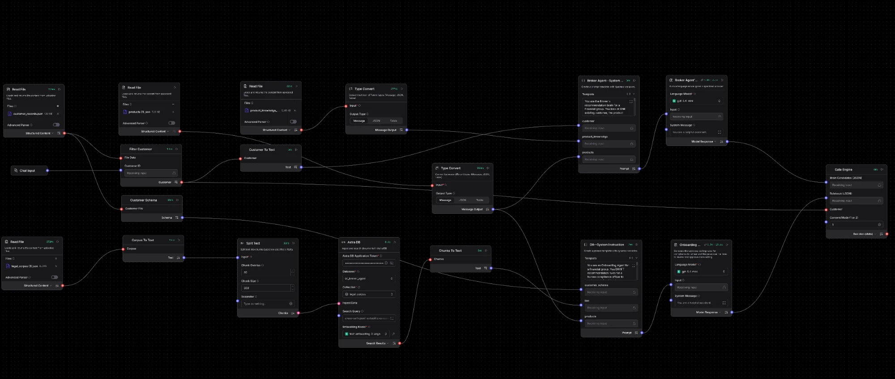
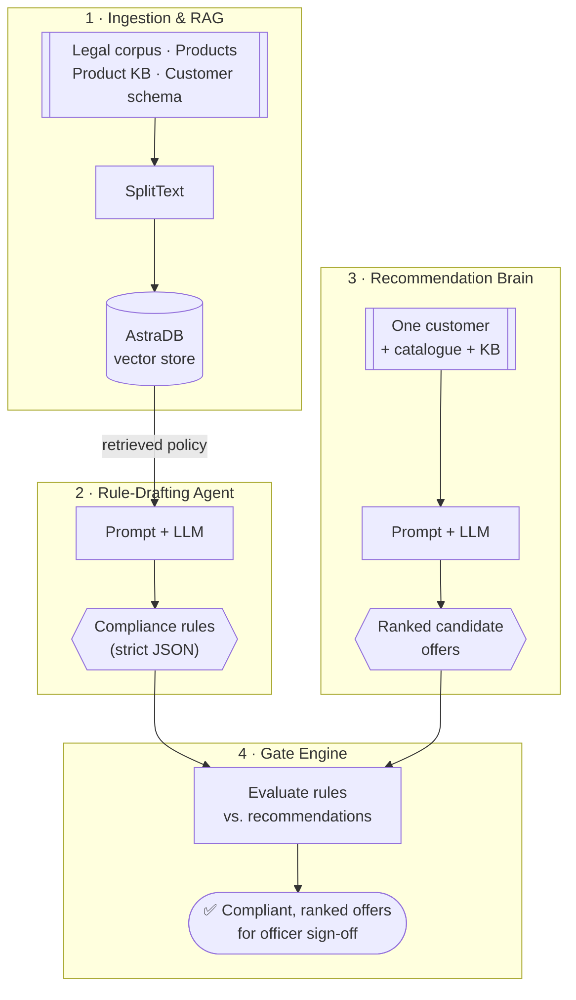

# AI Broker Agent 🏦🤖

> A compliance-aware **next-best-product engine** for a regulated financial-services group — it decides *what would sell* and *what is allowed to be offered*, as two separate jobs, with a human compliance officer in the loop.

Built as a [Langflow](https://www.langflow.org/) flow over a prototype catalogue for a Nigerian insurance-led group (*Custodian Investment Plc* — general insurance, life assurance, pensions, trusteeship).

---

## 🎯 The problem

Financial-services groups sit on a goldmine of cross-sell and upsell opportunity — a customer with term life probably needs an education plan; a pension holder may want voluntary top-ups. But in a **regulated** market, "the model thinks they'd buy it" is not enough. Every offer is bound by suitability rules, consent, licensing, and channel restrictions. Get it wrong and it's not a lost sale — it's a **regulatory breach**.

Today this reconciliation is manual: relationship managers eyeball spreadsheets, compliance reviews lag, and good offers either never go out or go out non-compliant.

**Two failure modes to avoid:**
| ❌ Naïve rec-engine | ❌ Manual compliance |
|---|---|
| Suggests products the customer legally can't be offered → breaches | Slow, inconsistent, doesn't scale → missed revenue |

## 💡 The product

An agent that **separates commercial intent from compliance**, mirroring how a regulated broker actually operates:

- **Recommendation Brain** finds and *ranks* every sensible next product per customer.
- **Rule-Drafting Agent** reads the group's law & policy (RAG) and *drafts* machine-readable compliance rules — it drafts, it never approves.
- **Gate Engine** enforces those rules so only compliant offers reach the customer.

The output is a ranked, **reason-coded**, compliance-gated offer list a compliance officer can sign off in one pass — turning a manual bottleneck into a reviewable pipeline.

## 🏗️ How it works

### The flow in Langflow

*The full pipeline on the Langflow canvas — file loaders and RAG on the left, the two LLM agents (recommendation brain + onboarding/rule-drafting) in the centre, and the Gate Engine consuming both on the right.*

### Logical architecture

| Stage | What it does | Key components |
|-------|--------------|----------------|
| **Ingestion / RAG** | Loads catalogue, KB & legal corpus; embeds policy into a vector store | 5× `File`, `SplitText`, `AstraDB` |
| **Rule-Drafting Agent** | Retrieves relevant law → drafts same-subsidiary compliance rules as JSON | `Prompt Template`, `LanguageModelComponent` |
| **Recommendation Brain** | Ranks every in-scope next product for one customer | `Prompt Template`, `LanguageModelComponent` |
| **Gate Engine** | Applies rules to recommendations; caps action level (Recommend → Inform → Silent) | `FilterCustomer`, `GateEngine`, `CustomerSchema` |

📄 **See a full worked example** (customer in → ranked, gated offers out): [`docs/example.md`](docs/example.md)
📋 **Product brief / PRD** (users, metrics, roadmap): [`docs/PRD.md`](docs/PRD.md)

## ⭐ Why the design is interesting

- **Separation of concerns** — commercial ranking and compliance are different models with different jobs. Neither can silently override the other.
- **Human-in-the-loop by design** — the agent *drafts* rules and *proposes* offers; a compliance officer signs. It augments, it doesn't rubber-stamp.
- **Grounded, auditable output** — every rule cites the law passage that justifies it; every offer carries a `reason_code` and `fit_reason`. Nothing is a black box.
- **Guardrails baked into the prompt** — offers are constrained to same-subsidiary moves, condition fields must exist in the customer schema, and categorical values must come from an allow-list. The model can't invent fields or products.
- **Conservative caps** — where the law stresses suitability, affordability, or licensed advice, the max action level is capped below "Recommend".

## 📦 Repository contents

| File | Description |
|------|-------------|
| `Broker Agent--Version B1.json` | The Langflow flow (secrets → `${ENV_VAR}` placeholders) |
| `products.json` | Catalogue — 10 products across 4 subsidiaries |
| `legal_corpus.json` | Policy/legal passages used for RAG |
| `product_knowledge_qa.json` | KB: who each product suits, when to recommend |
| `subsidiary_and_surfaces.json` | Group + subsidiary structure |
| `customer_records.sample.json` | 50 **synthetic** customer profiles (no real PII) |
| `docs/example.md` | End-to-end worked example |
| `docs/PRD.md` | One-page product brief |

## 🚀 Running it

1. `pip install langflow` → `langflow run`
2. **Import** `Broker Agent--Version B1.json` in the UI.
3. Provide credentials (nothing sensitive is committed — the flow ships with placeholders):
   - `OPENAI_API_KEY`, `ASTRA_DB_APPLICATION_TOKEN`, `ASTRA_DB_API_ENDPOINT`
4. Point the `File` loaders at the JSON data files and run.

## 🔒 Data & safety notes

- All customer data is **synthetic** — pseudonymous IDs (`cust_000001`), financial-profile attributes only. No names, emails, or phone numbers.
- No live credentials are committed; the flow uses environment-variable placeholders.

---

*Demonstrates agentic RAG, prompt engineering with hard guardrails, compliance-gated LLM reasoning, and product thinking for a regulated domain.*

📄 [MIT Licensed](LICENSE)
